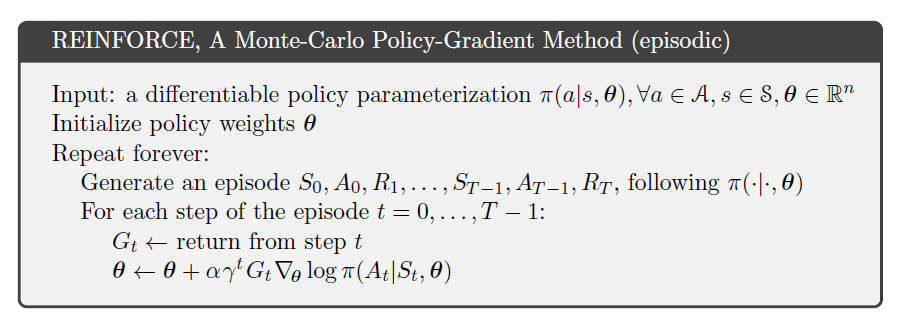
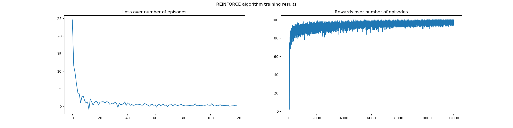

# Monte Carlo Policy Gradient (REINFORCE) Algorithm with Baseline

This implementation is based on the 1992 paper of R.J. Williams entitled *[Simple statistical gradient-following algorithms for  reinforcement learning](https://link.springer.com/article/10.1007/BF00992696)* that introduced the REINFORCE Algorithm also known as the Monte Carlo Policy Gradient. 

## Experiment
The policy is derived from a simple feed forward neural network that classifies the [MNIST Database of Handwritten Digits](http://yann.lecun.com/exdb/mnist/). The reward is based on the number of correct predictions that the policy yields, and to address high variance issue, a baseline that is independent from the policy parameters is subtracted to the reward function. 

## Results
The results show that the agent is maximizing the expected return following a certain policy.

## Usage
Install the dependencies from the requirements.txt file

    pip3 install -r requirements.txt
 
Adjust the Hyperparameters on the config file and simply run the following line of code inside the project directory:

    python3 main.py